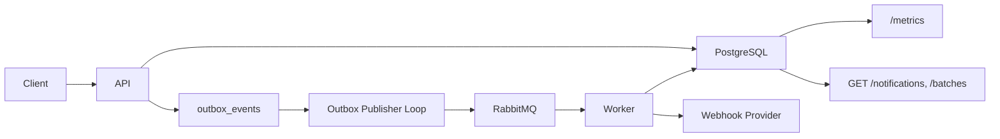

# Insider One Assessment

Notification delivery service implemented for the assessment brief.

The solution is intentionally small in surface area, but production-minded in the places that matter for this problem:

- durable asynchronous dispatch
- explicit delivery state transitions
- retry policy with bounded attempts
- idempotent create semantics
- operational visibility
- test coverage separated by layer

## Scope

Implemented:

- create single notifications
- create notification batches up to `1000` items
- message template CRUD
- notification creation via `template_id`
- query by notification ID
- query by batch ID
- list notifications with filters and pagination
- cancel pending notifications
- asynchronous dispatch via RabbitMQ
- transactional outbox
- scheduled notifications
- retry handling with exponential backoff and jitter
- health endpoint
- real-time metrics endpoint
- Swagger/OpenAPI
- Docker Compose local environment
- GitHub Actions CI

## Architecture

### Runtime components

- `api`
  accepts requests, validates input, writes notification state to PostgreSQL, and creates outbox events
- `worker`
  publishes due outbox events to RabbitMQ, consumes queued work, calls the provider, and updates delivery state
- `postgres`
  source of truth for notification state
- `rabbitmq`
  asynchronous transport between publisher and worker
- `pgadmin`
  local inspection utility

### System flow



End-to-end write flow:

1. the API accepts a notification request
2. notification rows and outbox rows are persisted in the same PostgreSQL transaction
3. the outbox publisher loop claims due events and publishes them to RabbitMQ
4. the worker consumes RabbitMQ messages, rate-limits by channel, and calls the provider
5. the worker records attempts and updates notification state in PostgreSQL

### Application layering

- `model`
  domain/entity types
- `dto/request`
  inbound transport contracts
- `dto/resource`
  outbound transport contracts
- `repository`
  persistence and SQL behavior
- `service`
  business rules and orchestration
- `handler`
  HTTP mapping only

This keeps transport, business logic, and persistence concerns separate and testable.

## Transactional Outbox

This solution uses the **Transactional Outbox Pattern**.

When a notification request is accepted:

1. notification rows are written to PostgreSQL, and batch rows are written only for explicit `POST /batches` requests
2. matching `outbox_events` rows are written in the same database transaction
3. a separate publisher loop polls due outbox rows and publishes them to RabbitMQ
4. published rows are marked as published

Why this exists:

- writing to PostgreSQL and RabbitMQ directly in the same request flow would create a dual-write gap
- without an outbox, the service could commit the notification row and crash before publishing to the broker
- the outbox makes initial dispatch, scheduled dispatch, and retry dispatch durable

## Delivery State Model

The service uses a deliberately small state machine:

- `pending`
- `queued`
- `processing`
- `sent`
- `failed`
- `cancelled`

### State semantics

- `pending`
  accepted and persisted, but not yet queued for processing or waiting for retry / scheduled release
- `queued`
  published to RabbitMQ and available for worker consumption
- `processing`
  currently being sent to the provider
- `sent`
  provider accepted the request
- `failed`
  terminal failure
- `cancelled`
  cancelled before terminal processing completed

### Allowed transitions

- `pending -> queued`
- `pending -> cancelled`
- `queued -> processing`
- `queued -> cancelled`
- `processing -> sent`
- `processing -> pending` for retry
- `processing -> failed`

Terminal states:

- `sent`
- `failed`
- `cancelled`

Important semantic note:

- `sent` means **provider accepted**
- it does **not** mean confirmed end-user delivery, because the assessment provider only exposes an acceptance-style response

## Delivery and Retry Policy

The assessment explicitly left retry and delivery behavior to candidate design. The implementation makes that behavior explicit.

### Delivery design decisions

- the API is synchronous only for acceptance, not for delivery completion
- accepted notifications are durably written to PostgreSQL before any broker interaction
- initial dispatch, scheduled dispatch, and retry dispatch all use the same outbox path
- `sent` means the provider accepted the request with `202`
- `failed` is terminal and means no more delivery attempts will be made
- single notifications and batch notifications share the same delivery semantics after persistence

### Failure classification

- provider `429`
- provider `5xx`
- transport/network errors
- timeout errors

- provider `4xx` except `429`
- malformed or unsupported downstream request shapes

### Retry behavior

- `max_attempts = 5`
- exponential backoff with jitter
- capped retry delay
- retry dispatch re-enters the outbox path instead of bypassing it
- every delivery attempt is written to `notification_attempts`
- if the consumer sees the message before the notification is fully transitioned to `queued`, it requeues instead of dropping the message
- per-channel rate limiting is applied before provider send

### Why this policy

- it keeps the HTTP layer fast and predictable
- it avoids the PostgreSQL/RabbitMQ dual-write gap
- it makes retries durable and observable instead of in-memory
- it bounds failure handling so poison notifications do not retry forever
- it keeps scheduled notifications and retries behaviorally consistent
- it makes every attempt auditable for debugging and interview discussion

This avoids infinite retry loops and keeps retry behavior auditable.

## Template System

Templates are implemented as an authoring convenience, not as a late-bound render dependency.

Behavior:

- templates support create, get, list, update, and delete
- each template is bound to a `channel`
- notification create accepts either `content` or `template_id`
- if `template_id` is used, the template content is resolved at create time
- the resolved content is snapshotted into `notifications.content`
- the original `template_id` is also stored on the notification for traceability

This means template edits affect future notifications, but do not mutate notifications that were already accepted.

Why this design:

- scheduled notifications remain deterministic
- retries resend the same payload
- accepted notifications stay immutable
- audit and debugging stay simple

## Scheduled Notifications

Scheduled notifications reuse the outbox mechanism instead of introducing a separate scheduler.

Behavior:

- `scheduled_at` is optional on create
- if omitted, the outbox event is immediately available
- if present, the outbox event is created with `available_at = scheduled_at`
- the outbox publisher loop only publishes rows where `available_at <= now()`

This keeps:

- immediate dispatch
- scheduled dispatch
- retry dispatch

on the same durable mechanism.

## Idempotency

Create requests support idempotency through the `Idempotency-Key` HTTP header.

Behavior:

- the request payload is hashed
- if the key does not exist, a new notification or batch is created based on the endpoint
- if the key exists with the same payload hash, the existing notification or batch is replayed
- if the key exists with a different payload hash, the request fails with conflict

This prevents duplicate notification or batch creation on retries or client-side replay.

## Rate Limiting

The worker applies a per-channel throughput limit.

Default:

- `100 msg/s` via `CHANNEL_RATE_LIMIT`

This is enforced at worker level and is intended as a simple operational throttle for the assessment scope.

## Observability

### Health

- `GET /health`

### Metrics

- `GET /metrics`

Current metrics include:

- queue depth
- success count
- failure count
- cancelled count
- pending count
- queued count
- processing count
- average latency
- counts by channel

### Logging

- structured JSON logging with `slog`
- configurable via `LOG_LEVEL`

### Tracing

- distributed tracing is enabled with OpenTelemetry
- API spans are emitted from the HTTP server and service layer
- async trace context is persisted into outbox payloads, forwarded via RabbitMQ headers, and continued by the worker
- provider calls are traced and exported to Jaeger over OTLP HTTP

Supported levels:

- `debug`
- `info`
- `warn`
- `error`

## Local Environment

### Application URLs

- API: [http://localhost:8080](http://localhost:8080)
- Swagger UI: [http://localhost:8080/swagger/index.html](http://localhost:8080/swagger/index.html)
- Metrics: [http://localhost:8080/metrics](http://localhost:8080/metrics)
- RabbitMQ UI: [http://localhost:15672](http://localhost:15672)
- pgAdmin: [http://localhost:5050](http://localhost:5050)
- Jaeger UI: [http://localhost:16686](http://localhost:16686)

Default credentials:
- PostgreSQL: `postgres` / `postgres`
- RabbitMQ: `guest` / `guest`
- pgAdmin: `admin@example.com` / `admin`

### Start the stack

```bash
docker compose up -d
```

The `migrate` service runs automatically as part of `docker compose up`.

If needed, migrations can be rerun manually:

```bash
docker compose run --rm migrate
```

For local end-to-end testing, you have two options:

- replace the placeholder `PROVIDER_URL` in [docker-compose.yml](/Users/bariseser/Desktop/insider-assessment/docker-compose.yml) with a real `webhook.site` URL
- or set `PROVIDER_MOCK_RESPONSE` for the worker to simulate provider responses without a real external callback sink

Examples:

- `PROVIDER_MOCK_RESPONSE=202` for success
- `PROVIDER_MOCK_RESPONSE=429` to exercise retryable rate-limit behavior
- `PROVIDER_MOCK_RESPONSE=500` to exercise retryable provider failure behavior
- `PROVIDER_MOCK_RESPONSE=404` to exercise terminal non-retryable failure behavior

## Development Commands

### Swagger

```bash
make docs
```

### Mocks

```bash
make mockgen-install
PATH="$PATH:$(go env GOPATH)/bin" make mocks
```

### Tests

```bash
make test-unit
make test-repository
make test-service
make test-dto
make test-integration
```

### Lint

```bash
make lint
```

## CI/CD

### Pull requests

GitHub Actions runs:

- formatting checks
- Swagger drift checks
- `golangci-lint`
- `go vet`
- test suite
- coverage merge steps

### Tags

Tags matching `v*` build the application image and publish it to:

- `ghcr.io/<owner>/<repo>`

### SonarCloud

SonarCloud is optional and runs only when:

- repository variable `SONAR_SCAN=true`
- `SONAR_PROJECT_KEY` variable exists
- `SONAR_ORGANIZATION` variable exists
- `SONAR_TOKEN` secret exists
